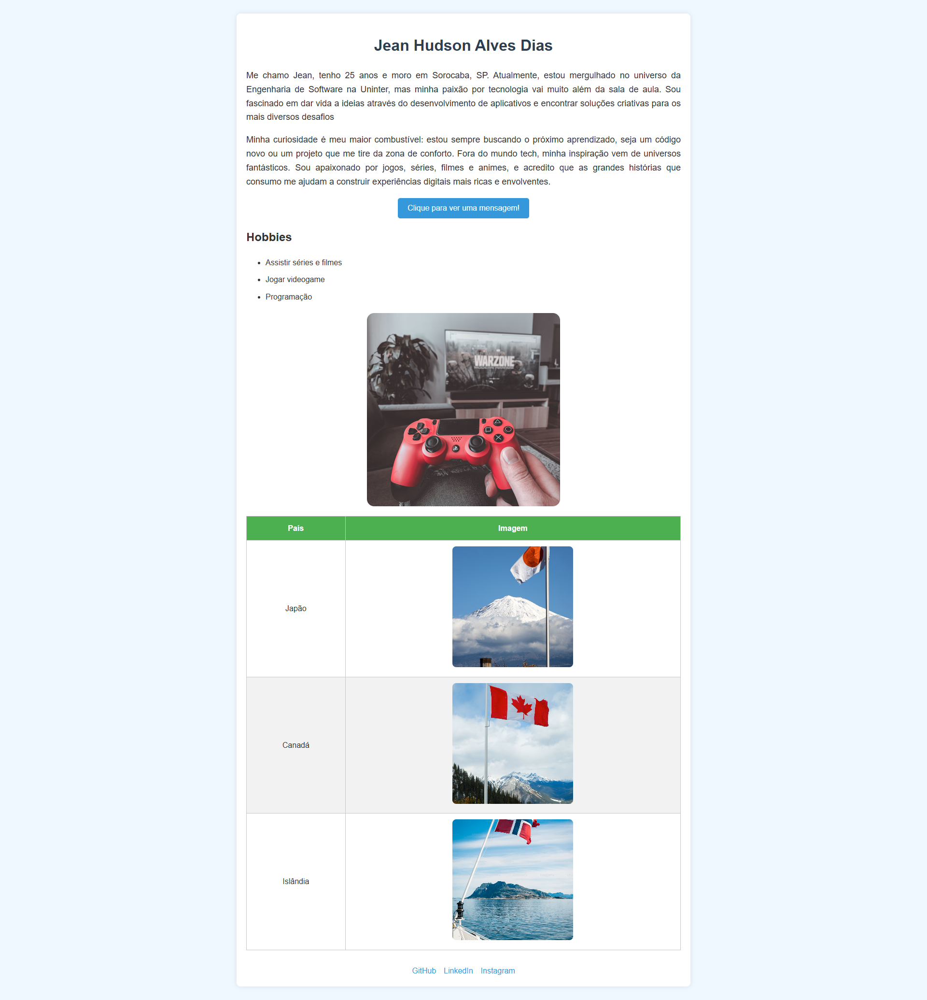

# Trabalho FDS - Jean Hudson Alves Dias

## 🚀 Site ao Vivo

Acesse o site publicado no GitHub Pages:

👉 [Clique aqui para ver o site ao vivo](https://jenacarry.github.io/trabalho-fds/)

## 📂 Repositório

Confira o código-fonte completo no GitHub:

👉 [Repositório no GitHub](https://github.com/jenacarry/trabalho-fds)

## 👨‍💻 Sobre o Projeto

Este projeto foi desenvolvido como parte de um trabalho acadêmico de Front-End. O objetivo foi construir uma página pessoal utilizando HTML, CSS e JavaScript.

## 🛠️ Tecnologias Utilizadas

- HTML5
- CSS3
- JavaScript

## 📸 Screenshot

Abaixo, um exemplo visual da interface do site:

## 🙋 Sobre o Autor

**Jean Hudson Alves Dias**

- 📍 Sorocaba - SP
- 🎓 Estudante de Engenharia de Software (Uninter)
- 💻 Apaixonado por tecnologia e desenvolvimento web

## 📬 Contato

- [GitHub](https://github.com/JenaCarry)
- [LinkedIn](https://www.linkedin.com/in/jean-h-dias/)
- [Instagram](https://www.instagram.com/jean__said/)
